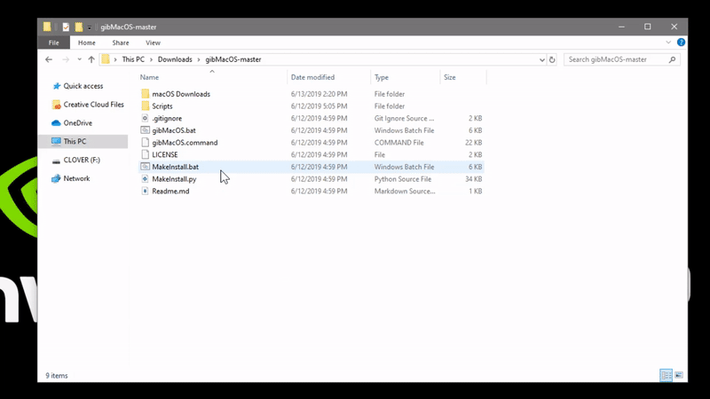
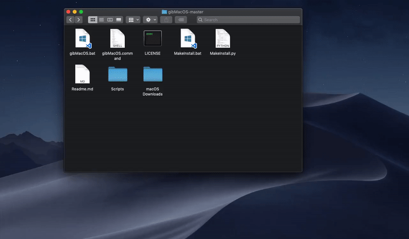

# Preparing the installer - Part 1

## From Windows

1. Plug in your USB.
2. Run MakeInstall.bat inside the gibMacOS folder.
3. A Command Prompt window should pop up. Your USB should be listed. Enter the number in front of your USB and press Enter.
4. It will format your USB. After that, shift + right click and copy the path of the downloaded macOS package `gibMacOS/macOS Downloads/publicrelease/xxx-xxxxx - xx.xx.x macOS xxxx/XXXX.pkg` to the cmd window and press enter.
5. It will start to extract the resources and restore them to your USB drive. This will take some time depending your USB speed. Be patient \(again\)! The script will automatically install Clover \(boot-loader\) to your USB after restoring the files.
6. Go to [Configuring Clover in Windows](https://raw.githubusercontent.com/doesprintfwork/hackintoshisfun.ml/docsify/clover-installtion/usb-clover/usb-clover-win.md) after finishing this part.



## From macOS

1. Rename the downloaded `XXXX.pkg` to `XXXX.dmg`
2. Double click on it and a it will mount a new volume
3. Go into the new volume and copy BaseSystem.dmg to desktop.
4. Go to disk utility. Click **View &gt; Show all devices** and find your USB **\(the whole disk instead of a partition, check out the gif below to know what I am talking\)** and format it to: 
    ```
    Name:   [whatever you want]
    Format: Mac OS Extended (Journaled)
    Scheme: GUID Partition Map
    ```
5. Now, choose your **USB partition** click Restore button in Disk Utility and choose Image...
6. Choose BaseSystem.dmg on desktop and press Restore.
7. This should take some time depending on your USB speed.
8. Go to [Install and Configuring Clover in macOS](../../clover-installtion/usb-clover/usb-clover-macos.md) after finishing this part.




