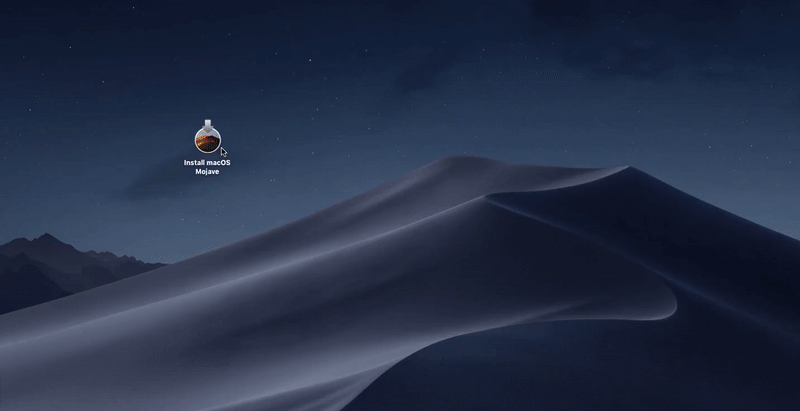

# Preparing the installer - Part 2

---

# From Windows

## Phase 1 -- Format, Partition, and Install Clover to your USB 

1. Plug in your USB if you haven't plug it in yet
2. Open BDU
3. Go to Options &gt; Configuration and press Check Now. By doing this, we make sure we have the latest Clover
4. Choose your USB listed in the List and press Format
5. The app will start to format your disk into 2 partition: 1. CLOVER \(the EFI partition. BDU will auto install Clover to it\) 2. HFS+ \(for your Installer Resources\)
6. Once it is done, do not close the window

## Phase 2 -- Extract and Restore Files from BaseSystem.dmg 

1. Go to BDU &gt; Tools &gt; Extract HFS \(HFS+\) from DMG-file.
2. Select the BaseSystem.dmg from the downloaded folder.
3. Choose Desktop as the Destination folder.
4. It will start to extract the 4.hfs file from BaseSystem.dmg. Be patient.
5. Once it is finished, the command promt window should be automatically closed.
6. Press the plus button next to the USB and choose Part 2.
7. Press Restore and choose the extracted 4.hfs file.
8. BDU will start to restore the files to your USB. Be patient.

## Phase 3 -- Extend the Volume and Convert to Full Installer

1. Open Paragon Disk Manager
2. Go to Partition Manager
3. Choose the second partition of your USB and choose Resize Partition
4. Set Space after partition to 0 and press OK
5. Press Apply
6. Close it and run TransMac as Administrator
7. Click on your USB and go to `macOS Base System (or OS X Base System)/Install macOS xxx.app/Contents`
8. Drag and drop the prepared SharedSupport folder here
9. Done! Proceed to the [next part](../../clover-installtion/usb-clover/usb-clover-win.md)!

---

# From macOS

1. Format your USB with these settings: `Name: USB Format: MacOS Extended Journaled Scheme: GUID Partition Map`
2. Right click on your macOS installer app\(from the previous step\) and click `Show Contents Packages`.
3. Go to `Contents/Resources` and find `createinstallmedia` inside that folder.
4. Open Terminal.
5. Type `sudo [drag and drop createinstallmedia here] --volume /Volumes/USB` and enter.
6. Follow the instructions. Be patient as it will take a lot of time.
7. Go to this [page](../../clover-installtion/usb-clover/usb-clover-macos.md) after finishing this part.

